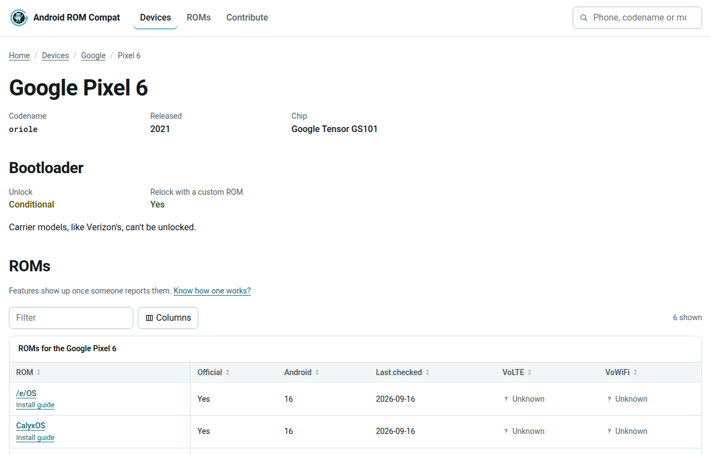

<h1 align="center">
  <br />
  Android ROM Compat
</h1>
<p align="center">
<i>Which Android ROMs run on your phone, what works on them, and whether the bootloader unlocks</i>
<br />
<b>🌐 <a href="https://android-rom-compat.peng.ly/">android-rom-compat.peng.ly</a></b><br />
</p>

<p align="center">
  
</p>

## About

Covers GrapheneOS, LineageOS, CalyxOS, /e/OS, crDroid and iodéOS, official builds only. Every bit of data lives as YAML in [`data/`](../data), so fixing a mistake is just a pull request away - no coding needed.

It'd rather leave a gap than guess, so anything nobody has checked shows as unknown.

---

## Contributing

Know a feature works (or doesn't) on your phone? Spotted something out of date? The [contributing guide](CONTRIBUTING.md) walks through it, and you can do the whole thing in GitHub's web editor. Or just fill in an [issue form](https://github.com/NotAFlightRisk/android-rom-compat/issues/new/choose) and we'll add it for you.

---

## API

The whole dataset is published as static JSON, rebuilt on every change. No key and no rate limit.

- [`/api/devices.json`](https://android-rom-compat.peng.ly/api/devices.json) - every device, with codenames, model numbers and bootloader info
- [`/api/roms.json`](https://android-rom-compat.peng.ly/api/roms.json) - the ROMs and how they compare
- [`/api/support.json`](https://android-rom-compat.peng.ly/api/support.json) - which ROM supports which device, and what works
- [`/api/features.json`](https://android-rom-compat.peng.ly/api/features.json) - the features we track

---

## Running it

It's a static [Astro](https://astro.build) site, so the build in `dist/` runs on any static host. You'll need Node 22 or newer.

```bash
git clone git@github.com:NotAFlightRisk/android-rom-compat.git
cd android-rom-compat
npm i
npm run dev        # dev server on localhost:4321
npm run validate   # check the data
npm run build      # build into dist/
```

Or run the pre-built image from [DockerHub](https://hub.docker.com/r/notaflightrisk/android-rom-compat) (also on [GHCR](https://github.com/NotAFlightRisk/android-rom-compat/pkgs/container/android-rom-compat)):

```bash
docker run -p 8080:8080 notaflightrisk/android-rom-compat
```

---

## Licence

The code is [MIT](../LICENSE). The data in `data/` is [CC BY-SA 4.0](../data/LICENSE), so reuse it however you like, just credit this project and share alike. ROM names and logos belong to their own projects.

##### Contributors

[](https://github.com/NotAFlightRisk/android-rom-compat/graphs/contributors)

---

<p  align="center">
  <a href="https://github.com/NotAFlightRisk"></a><br>
  <sup>
    <i>© <a href="https://github.com/NotAFlightRisk">NotAFlightRisk</a> 2026</i>
  </sup>
</p>
